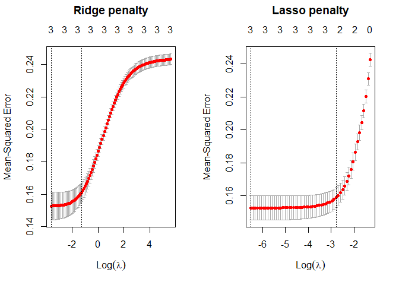
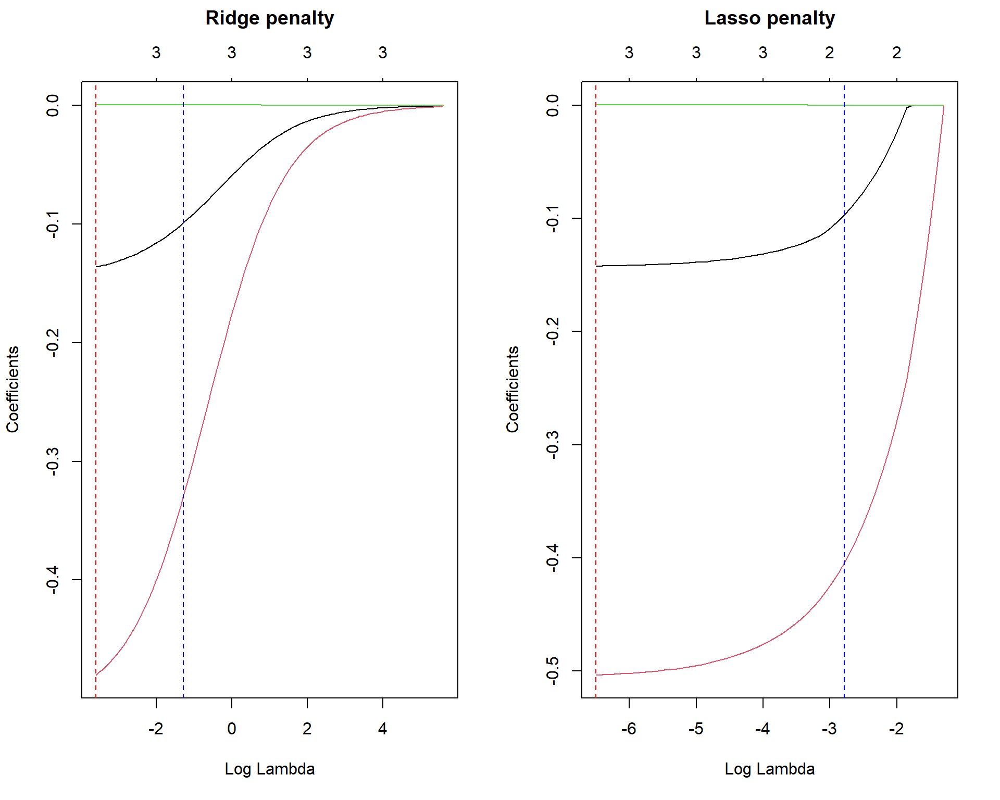
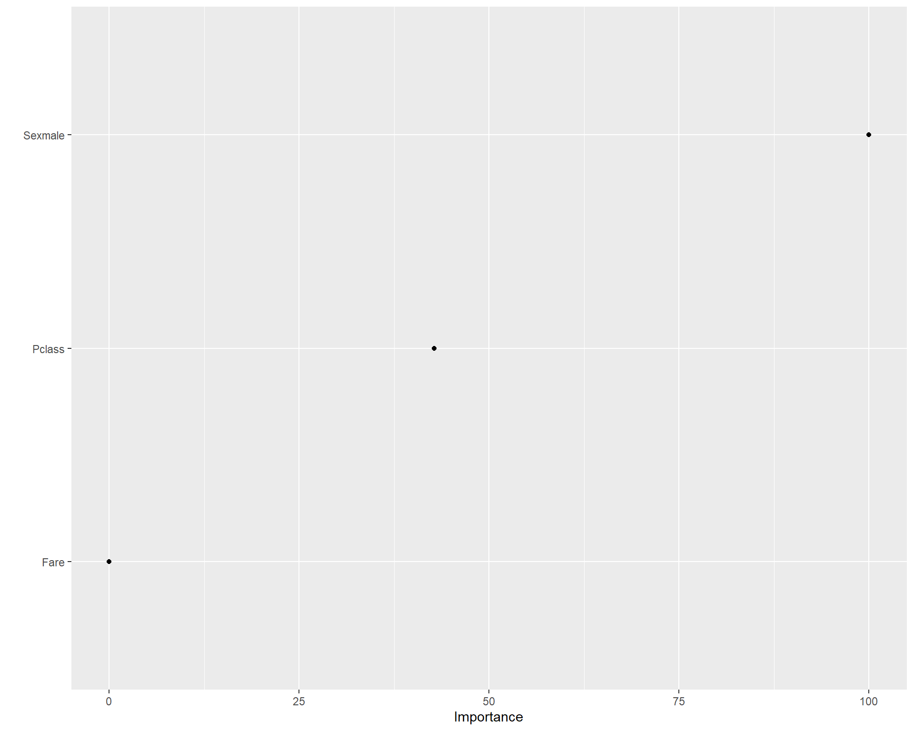
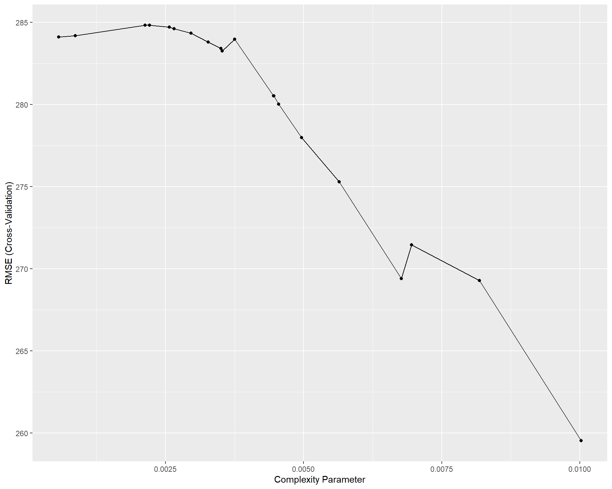
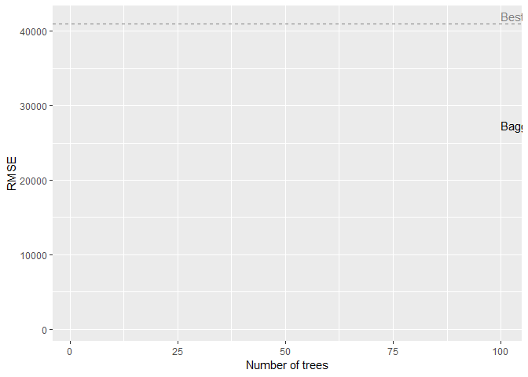

# Purpose: 20784538 Data Science Project

The purpose of this README is to provide the breakdown of the project.

The project focuses on a dataset for the titanic ship that sunk, and
contains data for the passengers, including sex, passenger class,
whether they had siblings, whether they survived or not and ticket
prices ecetera. The aim is to train a model to predict whether the
passenger would survive or not given the variables in the dataset.

The dataset was retrieved off Kaggle.

``` r
rm(list = ls()) # Clean your environment:
gc() # garbage collection - It can be useful to call gc after a large object has been removed, as this may prompt R to return memory to the operating system.
```

    ##          used (Mb) gc trigger (Mb) max used (Mb)
    ## Ncells 453681 24.3     974110 52.1   644242 34.5
    ## Vcells 811057  6.2    8388608 64.0  1634926 12.5

``` r
if (!require("pacman")) install.packages("pacman")
```

    ## Loading required package: pacman

``` r
pacman::p_load(dplyr, ggplot2, rsample, caret, glmnet, vip, tidyverse, pdp, rpart, doParallel, foreach, ipred, ranger, gbm, xgboost, randomForest)

list.files('code/', full.names = T, recursive = T) %>% .[grepl('.R', .)] %>% as.list() %>% walk(~source(.))
```

## Loading the data

``` r
titanic_data <- read.csv("C:/Users/mishq/OneDrive/Documents/Ro-eagan/Data Science for Econometrics S1/Data-Science-Project/Project/data/train.csv")
```

## Split data into train and test

``` r
set.seed(123)
split <- initial_split(titanic_data, prop = 0.7, strata = "Survived", na.rm = T)
titanic_train <- training(split)
titanic_test <- testing(split)

titanic_train <- na.omit(titanic_train)
```

``` r
model1 <- lm(PassengerId ~ Embarked, data = titanic_train) 
```

    ## 
    ## Call:
    ## lm(formula = PassengerId ~ Embarked, data = titanic_train)
    ## 
    ## Residuals:
    ##     Min      1Q  Median      3Q     Max 
    ## -442.22 -217.04   -7.35  228.53  483.00 
    ## 
    ## Coefficients:
    ##             Estimate Std. Error t value Pr(>|t|)  
    ## (Intercept) 446.0000   181.4753   2.458   0.0143 *
    ## EmbarkedC    15.4773   183.5259   0.084   0.9328  
    ## EmbarkedQ   -38.0000   190.7877  -0.199   0.8422  
    ## EmbarkedS    -0.7763   181.9412  -0.004   0.9966  
    ## ---
    ## Signif. codes:  0 '***' 0.001 '**' 0.01 '*' 0.05 '.' 0.1 ' ' 1
    ## 
    ## Residual standard error: 256.6 on 494 degrees of freedom
    ## Multiple R-squared:  0.001489,   Adjusted R-squared:  -0.004575 
    ## F-statistic: 0.2456 on 3 and 494 DF,  p-value: 0.8645

    ## Warning in randomForest.default(x = X, y = y, ntree = 100, mtry = 3, maxdepth =
    ## 5, : The response has five or fewer unique values.  Are you sure you want to do
    ## regression?

    ##     PassengerId Survived
    ## 1             1        0
    ## 2             2        1
    ## 5             5        0
    ## 10           10        1
    ## 17           17        0
    ## 18           18        0
    ## 24           24        0
    ## 30           30        0
    ## 32           32        1
    ## 34           34        0
    ## 35           35        0
    ## 36           36        0
    ## 39           39        1
    ## 48           48        0
    ## 50           50        1
    ## 57           57        1
    ## 58           58        0
    ## 59           59        1
    ## 63           63        0
    ## 65           65        0
    ## 67           67        1
    ## 68           68        0
    ## 69           69        1
    ## 74           74        0
    ## 75           75        1
    ## 76           76        0
    ## 78           78        0
    ## 80           80        1
    ## 81           81        0
    ## 87           87        0
    ## 95           95        0
    ## 97           97        0
    ## 98           98        0
    ## 101         101        1
    ## 103         103        0
    ## 104         104        0
    ## 106         106        0
    ## 107         107        1
    ## 108         108        0
    ## 110         110        0
    ## 112         112        0
    ## 115         115        0
    ## 122         122        0
    ## 123         123        0
    ## 136         136        0
    ## 137         137        1
    ## 142         142        0
    ## 147         147        0
    ## 148         148        0
    ## 153         153        0
    ## 155         155        0
    ## 158         158        0
    ## 165         165        0
    ## 167         167        1
    ## 170         170        1
    ## 179         179        0
    ## 182         182        0
    ## 183         183        0
    ## 187         187        1
    ## 188         188        1
    ## 189         189        0
    ## 200         200        1
    ## 201         201        0
    ## 202         202        1
    ## 205         205        0
    ## 210         210        0
    ## 211         211        0
    ## 212         212        1
    ## 214         214        0
    ## 218         218        0
    ## 219         219        1
    ## 222         222        0
    ## 229         229        0
    ## 230         230        0
    ## 234         234        0
    ## 240         240        0
    ## 246         246        1
    ## 262         262        0
    ## 263         263        0
    ## 265         265        0
    ## 268         268        0
    ## 272         272        0
    ## 273         273        1
    ## 276         276        1
    ## 279         279        0
    ## 282         282        0
    ## 283         283        0
    ## 290         290        0
    ## 293         293        0
    ## 294         294        1
    ## 295         295        0
    ## 296         296        0
    ## 298         298        1
    ## 299         299        1
    ## 302         302        0
    ## 303         303        0
    ## 307         307        1
    ## 308         308        1
    ## 320         320        1
    ## 322         322        0
    ## 329         329        0
    ## 334         334        0
    ## 336         336        0
    ## 353         353        0
    ## 358         358        1
    ## 369         369        0
    ## 370         370        1
    ## 371         371        0
    ## 372         372        0
    ## 373         373        0
    ## 376         376        1
    ## 377         377        1
    ## 378         378        0
    ## 380         380        0
    ## 390         390        1
    ## 392         392        0
    ## 397         397        1
    ## 398         398        0
    ## 400         400        1
    ## 404         404        0
    ## 405         405        1
    ## 406         406        0
    ## 410         410        0
    ## 414         414        0
    ## 429         429        0
    ## 435         435        0
    ## 436         436        1
    ## 439         439        0
    ## 441         441        1
    ## 443         443        0
    ## 446         446        0
    ## 447         447        1
    ## 453         453        0
    ## 455         455        0
    ## 457         457        1
    ## 458         458        1
    ## 459         459        1
    ## 465         465        0
    ## 468         468        1
    ## 472         472        0
    ## 492         492        0
    ## 493         493        1
    ## 495         495        0
    ## 498         498        0
    ## 504         504        1
    ## 507         507        1
    ## 508         508        1
    ## 509         509        0
    ## 517         517        1
    ## 520         520        0
    ## 524         524        1
    ## 526         526        0
    ## 529         529        0
    ## 530         530        0
    ## 537         537        1
    ## 538         538        1
    ## 541         541        1
    ## 543         543        0
    ## 544         544        0
    ## 545         545        0
    ## 552         552        0
    ## 556         556        1
    ## 557         557        1
    ## 562         562        0
    ## 564         564        0
    ## 566         566        0
    ## 571         571        0
    ## 573         573        1
    ## 574         574        0
    ## 578         578        1
    ## 579         579        0
    ## 582         582        1
    ## 584         584        0
    ## 588         588        0
    ## 591         591        0
    ## 593         593        0
    ## 600         600        0
    ## 605         605        1
    ## 612         612        0
    ## 613         613        1
    ## 616         616        1
    ## 626         626        0
    ## 629         629        0
    ## 631         631        0
    ## 632         632        0
    ## 634         634        0
    ## 637         637        0
    ## 638         638        0
    ## 640         640        0
    ## 643         643        0
    ## 646         646        0
    ## 650         650        1
    ## 651         651        0
    ## 652         652        1
    ## 657         657        0
    ## 658         658        1
    ## 659         659        0
    ## 661         661        0
    ## 663         663        0
    ## 666         666        0
    ## 667         667        0
    ## 670         670        1
    ## 675         675        0
    ## 678         678        0
    ## 689         689        0
    ## 690         690        1
    ## 691         691        0
    ## 692         692        1
    ## 702         702        1
    ## 703         703        0
    ## 705         705        0
    ## 708         708        1
    ## 710         710        0
    ## 712         712        1
    ## 713         713        0
    ## 716         716        0
    ## 720         720        0
    ## 727         727        1
    ## 729         729        0
    ## 733         733        0
    ## 739         739        0
    ## 740         740        0
    ## 743         743        1
    ## 747         747        0
    ## 749         749        0
    ## 750         750        0
    ## 751         751        1
    ## 755         755        1
    ## 759         759        0
    ## 772         772        0
    ## 780         780        1
    ## 785         785        0
    ## 787         787        1
    ## 793         793        0
    ## 801         801        0
    ## 803         803        0
    ## 804         804        0
    ## 806         806        0
    ## 808         808        1
    ## 817         817        1
    ## 818         818        1
    ## 822         822        0
    ## 824         824        1
    ## 825         825        0
    ## 827         827        1
    ## 831         831        0
    ## 832         832        0
    ## 834         834        0
    ## 836         836        1
    ## 846         846        0
    ## 849         849        0
    ## 850         850        1
    ## 851         851        0
    ## 855         855        1
    ## 857         857        1
    ## 859         859        1
    ## 862         862        0
    ## 864         864        0
    ## 867         867        1
    ## 868         868        0
    ## 873         873        0
    ## 874         874        0
    ## 875         875        1
    ## 878         878        0
    ## 879         879        0
    ## 882         882        0
    ## 884         884        0
    ## 886         886        0

    ##     PassengerId   Survived
    ## 1             1 0.07163771
    ## 2             2 0.99795048
    ## 5             5 0.18208206
    ## 10           10 0.98425132
    ## 17           17 0.06443225
    ## 18           18 0.13908513
    ## 24           24 0.31552317
    ## 30           30 0.10648080
    ## 32           32 0.94314562
    ## 34           34 0.07164489
    ## 35           35 0.24200109
    ## 36           36 0.13119801
    ## 39           39 0.56119437
    ## 48           48 0.41864288
    ## 50           50 0.56119437
    ## 57           57 0.76808345
    ## 58           58 0.16563009
    ## 59           59 0.94407223
    ## 63           63 0.25319992
    ## 65           65 0.22613864
    ## 67           67 0.76808345
    ## 68           68 0.18208206
    ## 69           69 0.57044214
    ## 74           74 0.13989469
    ## 75           75 0.78480474
    ## 76           76 0.07563771
    ## 78           78 0.18208206
    ## 80           80 0.68071771
    ## 81           81 0.06471009
    ## 87           87 0.12082114
    ## 95           95 0.07163771
    ## 97           97 0.20860440
    ## 98           98 0.16152279
    ## 101         101 0.60760881
    ## 103         103 0.27384958
    ## 104         104 0.06471009
    ## 106         106 0.10648080
    ## 107         107 0.55555421
    ## 108         108 0.06816308
    ## 110         110 0.16628595
    ## 112         112 0.45982824
    ## 115         115 0.45982824
    ## 122         122 0.18208206
    ## 123         123 0.45205295
    ## 136         136 0.30021221
    ## 137         137 0.92195877
    ## 142         142 0.41864288
    ## 147         147 0.06816308
    ## 148         148 0.18741225
    ## 153         153 0.18208206
    ## 155         155 0.07163771
    ## 158         158 0.18208206
    ## 165         165 0.04887126
    ## 167         167 0.99795048
    ## 170         170 0.78480474
    ## 179         179 0.13908513
    ## 182         182 0.30021221
    ## 183         183 0.09232114
    ## 187         187 0.63701791
    ## 188         188 0.55946511
    ## 189         189 0.21429152
    ## 200         200 0.98070581
    ## 201         201 0.26070549
    ## 202         202 0.51213808
    ## 205         205 0.18208206
    ## 210         210 0.27147421
    ## 211         211 0.05367169
    ## 212         212 0.61838678
    ## 214         214 0.13908513
    ## 218         218 0.22300272
    ## 219         219 0.99739493
    ## 222         222 0.13908513
    ## 229         229 0.13908513
    ## 230         230 0.14398076
    ## 234         234 0.32923044
    ## 240         240 0.07414348
    ## 246         246 0.56883012
    ## 262         262 0.09232114
    ## 263         263 0.23733443
    ## 265         265 0.41864288
    ## 268         268 0.06816308
    ## 272         272 0.05280554
    ## 273         273 0.81305791
    ## 276         276 0.99739493
    ## 279         279 0.06443225
    ## 282         282 0.12386790
    ## 283         283 0.26070549
    ## 290         290 0.41864288
    ## 293         293 0.13908513
    ## 294         294 0.58761070
    ## 295         295 0.10648080
    ## 296         296 0.22613864
    ## 298         298 0.70468828
    ## 299         299 0.64060047
    ## 302         302 0.07257273
    ## 303         303 0.05280554
    ## 307         307 0.98705010
    ## 308         308 0.98705010
    ## 320         320 0.99705010
    ## 322         322 0.10648080
    ## 329         329 0.46498740
    ## 334         334 0.19377503
    ## 336         336 0.10648080
    ## 353         353 0.16563009
    ## 358         358 0.98070581
    ## 369         369 0.41864288
    ## 370         370 0.99795048
    ## 371         371 0.47561202
    ## 372         372 0.05280554
    ## 373         373 0.18208206
    ## 376         376 0.99705010
    ## 377         377 0.63016027
    ## 378         378 0.34755462
    ## 380         380 0.06816308
    ## 390         390 0.96070581
    ## 392         392 0.06816308
    ## 397         397 0.57855200
    ## 398         398 0.18314715
    ## 400         400 0.97070581
    ## 404         404 0.40591573
    ## 405         405 0.50533278
    ## 406         406 0.12027940
    ## 410         410 0.14398076
    ## 414         414 0.04932788
    ## 429         429 0.12915732
    ## 435         435 0.47561202
    ## 436         436 0.99705010
    ## 439         439 0.34755462
    ## 441         441 0.98407223
    ## 443         443 0.06816308
    ## 446         446 0.24200109
    ## 447         447 0.81305791
    ## 453         453 0.22613864
    ## 455         455 0.18208206
    ## 457         457 0.55946511
    ## 458         458 0.99795048
    ## 459         459 0.76808345
    ## 465         465 0.18208206
    ## 468         468 0.55946511
    ## 472         472 0.06471009
    ## 492         492 0.07163771
    ## 493         493 0.64060047
    ## 495         495 0.18208206
    ## 498         498 0.14483170
    ## 504         504 0.51457686
    ## 507         507 0.92484506
    ## 508         508 0.55946511
    ## 509         509 0.07422954
    ## 517         517 0.76808345
    ## 520         520 0.10648080
    ## 524         524 0.99795048
    ## 526         526 0.12915732
    ## 529         529 0.32985685
    ## 530         530 0.06073172
    ## 537         537 0.55946511
    ## 538         538 0.98705010
    ## 541         541 0.99795048
    ## 543         543 0.12790211
    ## 544         544 0.18314715
    ## 545         545 0.38223369
    ## 552         552 0.18314715
    ## 556         556 0.55946511
    ## 557         557 0.97282604
    ## 562         562 0.10648080
    ## 564         564 0.18208206
    ## 566         566 0.07451843
    ## 571         571 0.07164489
    ## 573         573 0.62252629
    ## 574         574 0.41864288
    ## 578         578 0.99795048
    ## 579         579 0.45982824
    ## 582         582 0.98705010
    ## 584         584 0.17294404
    ## 588         588 0.22233443
    ## 591         591 0.06311613
    ## 593         593 0.07163771
    ## 600         600 0.46561202
    ## 605         605 0.55946511
    ## 612         612 0.05367169
    ## 613         613 0.63701791
    ## 616         616 0.98862363
    ## 626         626 0.17179981
    ## 629         629 0.10648080
    ## 631         631 0.41860230
    ## 632         632 0.05367169
    ## 634         634 0.05734090
    ## 637         637 0.32985685
    ## 638         638 0.16647985
    ## 640         640 0.11313401
    ## 643         643 0.12790211
    ## 646         646 0.37184958
    ## 650         650 0.55555421
    ## 651         651 0.10648080
    ## 652         652 0.92703492
    ## 657         657 0.10648080
    ## 658         658 0.63701791
    ## 659         659 0.13908513
    ## 661         661 0.45715032
    ## 663         663 0.32155889
    ## 666         666 0.06066973
    ## 667         667 0.13908513
    ## 670         670 0.99795048
    ## 675         675 0.04932788
    ## 678         678 0.28535695
    ## 689         689 0.06816308
    ## 690         690 0.98630733
    ## 691         691 0.45061202
    ## 692         692 0.62225541
    ## 702         702 0.62252629
    ## 703         703 0.45982824
    ## 705         705 0.12386790
    ## 708         708 0.62252629
    ## 710         710 0.17574080
    ## 712         712 0.55946511
    ## 713         713 0.13119801
    ## 716         716 0.07563771
    ## 720         720 0.06816308
    ## 727         727 0.61838678
    ## 729         729 0.18314715
    ## 733         733 0.04932788
    ## 739         739 0.10648080
    ## 740         740 0.10648080
    ## 743         743 0.98630733
    ## 747         747 0.29382012
    ## 749         749 0.45661202
    ## 750         750 0.12915732
    ## 751         751 0.92703492
    ## 755         755 0.98862363
    ## 759         759 0.18208206
    ## 772         772 0.12386790
    ## 780         780 0.98630733
    ## 785         785 0.05367169
    ## 787         787 0.55555421
    ## 793         793 0.37434888
    ## 801         801 0.13908513
    ## 803         803 0.48072499
    ## 804         804 0.06471009
    ## 806         806 0.06816308
    ## 808         808 0.50166708
    ## 817         817 0.57044214
    ## 818         818 0.63632157
    ## 822         822 0.06471009
    ## 824         824 0.68071771
    ## 825         825 0.04887126
    ## 827         827 0.78480474
    ## 831         831 0.45982824
    ## 832         832 0.48991852
    ## 834         834 0.12386790
    ## 836         836 0.99705010
    ## 846         846 0.06563771
    ## 849         849 0.40561919
    ## 850         850 0.99705010
    ## 851         851 0.09232114
    ## 855         855 0.92484506
    ## 857         857 0.96630733
    ## 859         859 0.64054053
    ## 862         862 0.06073172
    ## 864         864 0.37434888
    ## 867         867 0.98030581
    ## 868         868 0.12119801
    ## 873         873 0.05734090
    ## 874         874 0.06471009
    ## 875         875 0.96084404
    ## 878         878 0.10648080
    ## 879         879 0.10648080
    ## 882         882 0.10648080
    ## 884         884 0.07164489
    ## 886         886 0.12790211

``` r
ridge <- cv.glmnet(
    x = X,
    y = y,
    alpha = 0)

lasso <- cv.glmnet(
    x = X,
    y = y, 
    alpha = 1)
```

Plot the results:



``` r
# Ridge model
min(ridge$cvm)       # minimum MSE
```

    ## [1] 0.1527182

``` r
ridge$lambda.min     # lambda for this min MSE
```

    ## [1] 0.02742246

``` r
# Lasso model
min(lasso$cvm)       # minimum MSE
```

    ## [1] 0.1526486

``` r
lasso$lambda.min     # lambda for this min MSE
```

    ## [1] 0.001497891

``` r
lasso$nzero[lasso$lambda == lasso$lambda.min]
```

    ## s56 
    ##   3



``` r
set.seed(123)
cv_glmnet <- train(
  x = X,
  y = y,
  method = "glmnet",
  preProc = c("zv", "center", "scale"),
  trControl = trainControl(method = "cv", number = 10),
  tuneLength = 10
)
```

    ## Warning in train.default(x = X, y = y, method = "glmnet", preProc = c("zv", :
    ## You are trying to do regression and your outcome only has two possible values
    ## Are you trying to do classification? If so, use a 2 level factor as your
    ## outcome column.

``` r
cv_glmnet$bestTune
```

    ##   alpha      lambda
    ## 2   0.1 0.001562003

``` r
cv_glmnet$results %>%
  filter(alpha == cv_glmnet$bestTune$alpha, lambda == cv_glmnet$bestTune$lambda)
```

    ##   alpha      lambda      RMSE  Rsquared       MAE     RMSESD RsquaredSD
    ## 1   0.1 0.001562003 0.3888636 0.3726916 0.3040058 0.02389012 0.06400851
    ##        MAESD
    ## 1 0.01624269

``` r
pred <- predict(cv_glmnet, X)

RMSE(exp(pred), exp(y))
```

    ## [1] 0.6733232



``` r
titanic_train1 <- rpart(
    formula = PassengerId ~ ., 
    data = titanic_train,
    method = "anova"
)

titanic_train1
```

    ## n= 498 
    ## 
    ## node), split, n, deviance, yval
    ##       * denotes terminal node
    ## 
    ##  1) root 498 32586590.00 446.67870  
    ##    2) Name=Abbott, Mrs. Stanton (Rosa Hunt),Abelson, Mr. Samuel,Adahl, Mr. Mauritz Nils Martin,Adams, Mr. John,Ahlin, Mrs. Johan (Johanna Persdotter Larsson),Albimona, Mr. Nassef Cassem,Allison, Master. Hudson Trevor,Andersen-Jensen, Miss. Carla Christine Nielsine,Andersson, Miss. Ellis Anna Maria,Andersson, Mr. Anders Johan,Andreasson, Mr. Paul Edvin,Andrew, Mr. Edgardo Samuel,Arnold-Franchi, Mr. Josef,Asim, Mr. Adola,Asplund, Mrs. Carl Oscar (Selma Augusta Emilia Johansson),Attalah, Mr. Sleiman,Backstrom, Mr. Karl Alfred,Backstrom, Mrs. Karl Alfred (Maria Mathilda Gustafsson),Baclini, Miss. Marie Catherine,Ball, Mrs. (Ada E Hall),Barbara, Mrs. (Catherine David),Barber, Miss. Ellen "Nellie",Barton, Mr. David John,Bateman, Rev. Robert James,Baxter, Mr. Quigg Edmond,Baxter, Mrs. James (Helene DeLaudeniere Chaput),Becker, Master. Richard F,Beckwith, Mr. Richard Leonard,Beesley, Mr. Lawrence,Bengtsson, Mr. John Viktor,Berglund, Mr. Karl Ivar Sven,Betros, Mr. Tannous,Bidois, Miss. Rosalie,Birkeland, Mr. Hans Martin Monsen,Bishop, Mrs. Dickinson H (Helen Walton),Bissette, Miss. Amelia,Bjornstrom-Steffansson, Mr. Mauritz Hakan,Blackwell, Mr. Stephen Weart,Bonnell, Miss. Elizabeth,Bowerman, Miss. Elsie Edith,Brown, Miss. Amelia "Mildred",Brown, Mrs. James Joseph (Margaret Tobin),Burke, Mr. Jeremiah,Burns, Miss. Elizabeth Margaret,Buss, Miss. Kate,Byles, Rev. Thomas Roussel Davids,Caldwell, Master. Alden Gates,Caldwell, Mrs. Albert Francis (Sylvia Mae Harbaugh),Calic, Mr. Jovo,Cann, Mr. Ernest Charles,Carbines, Mr. William,Carr, Miss. Helen "Ellen",Carrau, Mr. Francisco M,Carter, Mr. William Ernest,Carter, Rev. Ernest Courtenay,Celotti, Mr. Francesco,Chaffee, Mr. Herbert Fuller,Charters, Mr. David,Cherry, Miss. Gladys,Christmann, Mr. Emil,Clarke, Mrs. Charles V (Ada Maria Winfield),Coelho, Mr. Domingos Fernandeo,Coleridge, Mr. Reginald Charles,Collander, Mr. Erik Gustaf,Collyer, Miss. Marjorie "Lottie",Connors, Mr. Patrick,Coutts, Master. William Loch "William",Cribb, Mr. John Hatfield,Dahl, Mr. Karl Edwart,Danbom, Mrs. Ernst Gilbert (Anna Sigrid Maria Brogren),Davies, Mr. Charles Henry,de Mulder, Mr. Theodore,Dean, Mr. Bertram Frank,del Carlo, Mr. Sebastiano,Dennis, Mr. Samuel,Devaney, Miss. Margaret Delia,Dimic, Mr. Jovan,Doling, Mrs. John T (Ada Julia Bone),Dorking, Mr. Edward Arthur,Drazenoic, Mr. Jozef,Drew, Mrs. James Vivian (Lulu Thorne Christian),Duane, Mr. Frank,Ekstrom, Mr. Johan,Faunthorpe, Mrs. Lizzie (Elizabeth Anne Wilkinson),Ford, Miss. Doolina Margaret "Daisy",Fortune, Miss. Alice Elizabeth,Fortune, Miss. Mabel Helen,Fortune, Mr. Charles Alexander,Fox, Mr. Stanley Hubert,Francatelli, Miss. Laura Mabel,Futrelle, Mr. Jacques Heath,Futrelle, Mrs. Jacques Heath (Lily May Peel),Fynney, Mr. Joseph J,Giglio, Mr. Victor,Gilnagh, Miss. Katherine "Katie",Goldenberg, Mr. Samuel L,Goldsmith, Master. Frank John William "Frankie",Goodwin, Master. Sidney Leonard,Goodwin, Master. William Frederick,Goodwin, Miss. Lillian Amy,Graham, Mr. George Edward,Graham, Mrs. William Thompson (Edith Junkins),Green, Mr. George Henry,Gustafsson, Mr. Anders Vilhelm,Gustafsson, Mr. Johan Birger,Hakkarainen, Mrs. Pekka Pietari (Elin Matilda Dolck),Hamalainen, Mrs. William (Anna),Hampe, Mr. Leon,Hanna, Mr. Mansour,Harper, Mrs. Henry Sleeper (Myna Haxtun),Harris, Mr. Walter,Harris, Mrs. Henry Birkhardt (Irene Wallach),Harrison, Mr. William,Hart, Mr. Benjamin,Hays, Miss. Margaret Bechstein,Heikkinen, Miss. Laina,Hendekovic, Mr. Ignjac,Hewlett, Mrs. (Mary D Kingcome) ,Hickman, Mr. Stanley George,Hippach, Miss. Jean Gertrude,Hold, Mr. Stephen,Holverson, Mrs. Alexander Oskar (Mary Aline Towner),Honkanen, Miss. Eliina,Hood, Mr. Ambrose Jr,Hosono, Mr. Masabumi,Hoyt, Mr. Frederick Maxfield,Icard, Miss. Amelie,Ilett, Miss. Bertha,Isham, Miss. Ann Elizabeth,Jenkin, Mr. Stephen Curnow,Johanson, Mr. Jakob Alfred,Johansson, Mr. Erik,Johnson, Miss. Eleanor Ileen,Johnson, Mrs. Oscar W (Elisabeth Vilhelmina Berg),Jussila, Miss. Katriina,Jussila, Miss. Mari Aina,Kallio, Mr. Nikolai Erland,Kantor, Mr. Sinai,Kantor, Mrs. Sinai (Miriam Sternin),Kink-Heilmann, Miss. Luise Gretchen,Kink, Mr. Vincenz,Klasen, Mr. Klas Albin,Kvillner, Mr. Johan Henrik Johannesson,Lahtinen, Mrs. William (Anna Sylfven),Laroche, Miss. Simonne Marie Anne Andree,Larsson, Mr. Bengt Edvin,Leonard, Mr. Lionel,Leyson, Mr. Robert William Norman,Lindahl, Miss. Agda Thorilda Viktoria,Lindblom, Miss. Augusta Charlotta,Lobb, Mr. William Arthur,Louch, Mrs. Charles Alexander (Alice Adelaide Slow),Lovell, Mr. John Hall ("Henry"),Lurette, Miss. Elise,Madsen, Mr. Fridtjof Arne,Maenpaa, Mr. Matti Alexanteri,Matthews, Mr. William John,McCarthy, Mr. Timothy J,McGowan, Miss. Anna "Annie",Mellors, Mr. William John,Minahan, Miss. Daisy E,Moraweck, Dr. Ernest,Naidenoff, Mr. Penko,Nakid, Miss. Maria ("Mary"),Natsch, Mr. Charles H,Navratil, Master. Edmond Roger,Navratil, Master. Michel M,Navratil, Mr. Michel ("Louis M Hoffman"),Newell, Miss. Madeleine,Newell, Miss. Marjorie,Nicholls, Mr. Joseph Charles,Nicola-Yarred, Master. Elias,Nicola-Yarred, Miss. Jamila,Nilsson, Miss. Helmina Josefina,Niskanen, Mr. Juha,Nosworthy, Mr. Richard Cater,Nysveen, Mr. Johan Hansen,Odahl, Mr. Nils Martin,Olsen, Mr. Karl Siegwart Andreas,Osen, Mr. Olaf Elon,Ostby, Mr. Engelhart Cornelius,Pain, Dr. Alfred,Palsson, Master. Gosta Leonard,Palsson, Miss. Stina Viola,Palsson, Miss. Torborg Danira,Panula, Master. Juha Niilo,Panula, Mr. Ernesti Arvid,Parrish, Mrs. (Lutie Davis),Partner, Mr. Austen,Pears, Mr. Thomas Clinton,Pears, Mrs. Thomas (Edith Wearne),Pekoniemi, Mr. Edvard,Pengelly, Mr. Frederick William,Perkin, Mr. John Henry,Peuchen, Major. Arthur Godfrey,Phillips, Miss. Kate Florence ("Mrs Kate Louise Phillips Marshall"),Pickard, Mr. Berk (Berk Trembisky),Pinsky, Mrs. (Rosa),Porter, Mr. Walter Chamberlain,Reeves, Mr. David,Rekic, Mr. Tido,Reynaldo, Ms. Encarnacion,Rice, Master. Arthur,Richards, Master. William Rowe,Richards, Mrs. Sidney (Emily Hocking),Ringhini, Mr. Sante,Robins, Mrs. Alexander A (Grace Charity Laury),Rosblom, Mr. Viktor Richard,Rosblom, Mrs. Viktor (Helena Wilhelmina),Ryerson, Miss. Emily Borie,Sandstrom, Miss. Marguerite Rut,Sandstrom, Mrs. Hjalmar (Agnes Charlotta Bengtsson),Saundercock, Mr. William Henry,Sedgwick, Mr. Charles Frederick Waddington,Seward, Mr. Frederic Kimber,Sheerlinck, Mr. Jan Baptist,Silven, Miss. Lyyli Karoliina,Sirayanian, Mr. Orsen,Sivola, Mr. Antti Wilhelm,Sjostedt, Mr. Ernst Adolf,Skoog, Master. Harald,Skoog, Mr. Wilhelm,Skoog, Mrs. William (Anna Bernhardina Karlsson),Slayter, Miss. Hilda Mary,Smith, Miss. Marion Elsie,Smith, Mr. James Clinch,Sobey, Mr. Samuel James Hayden,Stankovic, Mr. Ivan,Stead, Mr. William Thomas,Strom, Miss. Telma Matilda,Strom, Mrs. Wilhelm (Elna Matilda Persson),Sunderland, Mr. Victor Francis,Sundman, Mr. Johan Julian,Tikkanen, Mr. Juho,Touma, Mrs. Darwis (Hanne Youssef Razi),Turcin, Mr. Stjepan,Turpin, Mr. William John Robert,Turpin, Mrs. William John Robert (Dorothy Ann Wonnacott),Uruchurtu, Don. Manuel E,van Billiard, Mr. Austin Blyler,Van der hoef, Mr. Wyckoff,Van Impe, Miss. Catharina,Vanden Steen, Mr. Leo Peter,Vander Planke, Mrs. Julius (Emelia Maria Vandemoortele),Vestrom, Miss. Hulda Amanda Adolfina,Ward, Miss. Anna,Warren, Mrs. Frank Manley (Anna Sophia Atkinson),Watt, Mrs. James (Elizabeth "Bessie" Inglis Milne),Webber, Miss. Susan,Weisz, Mrs. Leopold (Mathilde Francoise Pede),West, Mr. Edwy Arthur,White, Mr. Percival Wayland,Wick, Miss. Mary Natalie,Widegren, Mr. Carl/Charles Peter,Williams, Mr. Charles Duane,Young, Miss. Marie Grice,Youseff, Mr. Gerious,Zimmerman, Mr. Leo 258  4324758.00 232.53100  
    ##      4) Name=Ahlin, Mrs. Johan (Johanna Persdotter Larsson),Albimona, Mr. Nassef Cassem,Andersen-Jensen, Miss. Carla Christine Nielsine,Andersson, Miss. Ellis Anna Maria,Andersson, Mr. Anders Johan,Andreasson, Mr. Paul Edvin,Andrew, Mr. Edgardo Samuel,Asplund, Mrs. Carl Oscar (Selma Augusta Emilia Johansson),Backstrom, Mr. Karl Alfred,Backstrom, Mrs. Karl Alfred (Maria Mathilda Gustafsson),Barton, Mr. David John,Bateman, Rev. Robert James,Baxter, Mr. Quigg Edmond,Becker, Master. Richard F,Beesley, Mr. Lawrence,Bengtsson, Mr. John Viktor,Berglund, Mr. Karl Ivar Sven,Bonnell, Miss. Elizabeth,Brown, Mrs. James Joseph (Margaret Tobin),Burke, Mr. Jeremiah,Byles, Rev. Thomas Roussel Davids,Caldwell, Master. Alden Gates,Calic, Mr. Jovo,Cann, Mr. Ernest Charles,Carbines, Mr. William,Carr, Miss. Helen "Ellen",Carrau, Mr. Francisco M,Celotti, Mr. Francesco,Chaffee, Mr. Herbert Fuller,Christmann, Mr. Emil,Coelho, Mr. Domingos Fernandeo,Connors, Mr. Patrick,Cribb, Mr. John Hatfield,Dean, Mr. Bertram Frank,Devaney, Miss. Margaret Delia,Doling, Mrs. John T (Ada Julia Bone),Drazenoic, Mr. Jozef,Ekstrom, Mr. Johan,Faunthorpe, Mrs. Lizzie (Elizabeth Anne Wilkinson),Fortune, Miss. Mabel Helen,Fortune, Mr. Charles Alexander,Futrelle, Mr. Jacques Heath,Futrelle, Mrs. Jacques Heath (Lily May Peel),Fynney, Mr. Joseph J,Giglio, Mr. Victor,Gilnagh, Miss. Katherine "Katie",Goldsmith, Master. Frank John William "Frankie",Goodwin, Master. William Frederick,Goodwin, Miss. Lillian Amy,Green, Mr. George Henry,Gustafsson, Mr. Anders Vilhelm,Hakkarainen, Mrs. Pekka Pietari (Elin Matilda Dolck),Harper, Mrs. Henry Sleeper (Myna Haxtun),Harris, Mr. Walter,Heikkinen, Miss. Laina,Hewlett, Mrs. (Mary D Kingcome) ,Hickman, Mr. Stanley George,Honkanen, Miss. Eliina,Hood, Mr. Ambrose Jr,Hoyt, Mr. Frederick Maxfield,Icard, Miss. Amelie,Ilett, Miss. Bertha,Isham, Miss. Ann Elizabeth,Jenkin, Mr. Stephen Curnow,Johanson, Mr. Jakob Alfred,Johnson, Miss. Eleanor Ileen,Johnson, Mrs. Oscar W (Elisabeth Vilhelmina Berg),Jussila, Miss. Katriina,Kantor, Mr. Sinai,Kink-Heilmann, Miss. Luise Gretchen,Kink, Mr. Vincenz,Klasen, Mr. Klas Albin,Laroche, Miss. Simonne Marie Anne Andree,Leonard, Mr. Lionel,Lovell, Mr. John Hall ("Henry"),Lurette, Miss. Elise,Madsen, Mr. Fridtjof Arne,McCarthy, Mr. Timothy J,McGowan, Miss. Anna "Annie",Mellors, Mr. William John,Navratil, Master. Michel M,Navratil, Mr. Michel ("Louis M Hoffman"),Newell, Miss. Madeleine,Nicholls, Mr. Joseph Charles,Nicola-Yarred, Master. Elias,Nicola-Yarred, Miss. Jamila,Nosworthy, Mr. Richard Cater,Olsen, Mr. Karl Siegwart Andreas,Osen, Mr. Olaf Elon,Ostby, Mr. Engelhart Cornelius,Palsson, Master. Gosta Leonard,Palsson, Miss. Torborg Danira,Panula, Master. Juha Niilo,Pears, Mrs. Thomas (Edith Wearne),Pekoniemi, Mr. Edvard,Perkin, Mr. John Henry,Pinsky, Mrs. (Rosa),Porter, Mr. Walter Chamberlain,Rekic, Mr. Tido,Rice, Master. Arthur,Robins, Mrs. Alexander A (Grace Charity Laury),Sandstrom, Miss. Marguerite Rut,Saundercock, Mr. William Henry,Sheerlinck, Mr. Jan Baptist,Sirayanian, Mr. Orsen,Sivola, Mr. Antti Wilhelm,Skoog, Master. Harald,Skoog, Mrs. William (Anna Bernhardina Karlsson),Smith, Mr. James Clinch,Sobey, Mr. Samuel James Hayden,Strom, Miss. Telma Matilda,Sunderland, Mr. Victor Francis,Turcin, Mr. Stjepan,Turpin, Mr. William John Robert,Turpin, Mrs. William John Robert (Dorothy Ann Wonnacott),Uruchurtu, Don. Manuel E,van Billiard, Mr. Austin Blyler,Van der hoef, Mr. Wyckoff,Vander Planke, Mrs. Julius (Emelia Maria Vandemoortele),Vestrom, Miss. Hulda Amanda Adolfina,Watt, Mrs. James (Elizabeth "Bessie" Inglis Milne),Webber, Miss. Susan,Weisz, Mrs. Leopold (Mathilde Francoise Pede),White, Mr. Percival Wayland,Williams, Mr. Charles Duane,Youseff, Mr. Gerious 126   548804.90 118.23810  
    ##        8) Name=Ahlin, Mrs. Johan (Johanna Persdotter Larsson),Andersson, Mr. Anders Johan,Andreasson, Mr. Paul Edvin,Asplund, Mrs. Carl Oscar (Selma Augusta Emilia Johansson),Backstrom, Mrs. Karl Alfred (Maria Mathilda Gustafsson),Beesley, Mr. Lawrence,Bonnell, Miss. Elizabeth,Caldwell, Master. Alden Gates,Cann, Mr. Ernest Charles,Carrau, Mr. Francisco M,Celotti, Mr. Francesco,Chaffee, Mr. Herbert Fuller,Christmann, Mr. Emil,Dean, Mr. Bertram Frank,Devaney, Miss. Margaret Delia,Doling, Mrs. John T (Ada Julia Bone),Faunthorpe, Mrs. Lizzie (Elizabeth Anne Wilkinson),Fortune, Miss. Mabel Helen,Fortune, Mr. Charles Alexander,Futrelle, Mrs. Jacques Heath (Lily May Peel),Fynney, Mr. Joseph J,Goodwin, Master. William Frederick,Goodwin, Miss. Lillian Amy,Gustafsson, Mr. Anders Vilhelm,Harper, Mrs. Henry Sleeper (Myna Haxtun),Heikkinen, Miss. Laina,Hewlett, Mrs. (Mary D Kingcome) ,Hood, Mr. Ambrose Jr,Icard, Miss. Amelie,Ilett, Miss. Bertha,Jenkin, Mr. Stephen Curnow,Johnson, Mrs. Oscar W (Elisabeth Vilhelmina Berg),Kantor, Mr. Sinai,Kink, Mr. Vincenz,Laroche, Miss. Simonne Marie Anne Andree,McCarthy, Mr. Timothy J,McGowan, Miss. Anna "Annie",Nicola-Yarred, Miss. Jamila,Nosworthy, Mr. Richard Cater,Ostby, Mr. Engelhart Cornelius,Palsson, Master. Gosta Leonard,Palsson, Miss. Torborg Danira,Panula, Master. Juha Niilo,Sandstrom, Miss. Marguerite Rut,Saundercock, Mr. William Henry,Sheerlinck, Mr. Jan Baptist,Sirayanian, Mr. Orsen,Skoog, Master. Harald,Turpin, Mrs. William John Robert (Dorothy Ann Wonnacott),Uruchurtu, Don. Manuel E,Vander Planke, Mrs. Julius (Emelia Maria Vandemoortele),Vestrom, Miss. Hulda Amanda Adolfina 52    49718.92  50.46154 *
    ##        9) Name=Albimona, Mr. Nassef Cassem,Andersen-Jensen, Miss. Carla Christine Nielsine,Andersson, Miss. Ellis Anna Maria,Andrew, Mr. Edgardo Samuel,Backstrom, Mr. Karl Alfred,Barton, Mr. David John,Bateman, Rev. Robert James,Baxter, Mr. Quigg Edmond,Becker, Master. Richard F,Bengtsson, Mr. John Viktor,Berglund, Mr. Karl Ivar Sven,Brown, Mrs. James Joseph (Margaret Tobin),Burke, Mr. Jeremiah,Byles, Rev. Thomas Roussel Davids,Calic, Mr. Jovo,Carbines, Mr. William,Carr, Miss. Helen "Ellen",Coelho, Mr. Domingos Fernandeo,Connors, Mr. Patrick,Cribb, Mr. John Hatfield,Drazenoic, Mr. Jozef,Ekstrom, Mr. Johan,Futrelle, Mr. Jacques Heath,Giglio, Mr. Victor,Gilnagh, Miss. Katherine "Katie",Goldsmith, Master. Frank John William "Frankie",Green, Mr. George Henry,Hakkarainen, Mrs. Pekka Pietari (Elin Matilda Dolck),Harris, Mr. Walter,Hickman, Mr. Stanley George,Honkanen, Miss. Eliina,Hoyt, Mr. Frederick Maxfield,Isham, Miss. Ann Elizabeth,Johanson, Mr. Jakob Alfred,Johnson, Miss. Eleanor Ileen,Jussila, Miss. Katriina,Kink-Heilmann, Miss. Luise Gretchen,Klasen, Mr. Klas Albin,Leonard, Mr. Lionel,Lovell, Mr. John Hall ("Henry"),Lurette, Miss. Elise,Madsen, Mr. Fridtjof Arne,Mellors, Mr. William John,Navratil, Master. Michel M,Navratil, Mr. Michel ("Louis M Hoffman"),Newell, Miss. Madeleine,Nicholls, Mr. Joseph Charles,Nicola-Yarred, Master. Elias,Olsen, Mr. Karl Siegwart Andreas,Osen, Mr. Olaf Elon,Pears, Mrs. Thomas (Edith Wearne),Pekoniemi, Mr. Edvard,Perkin, Mr. John Henry,Pinsky, Mrs. (Rosa),Porter, Mr. Walter Chamberlain,Rekic, Mr. Tido,Rice, Master. Arthur,Robins, Mrs. Alexander A (Grace Charity Laury),Sivola, Mr. Antti Wilhelm,Skoog, Mrs. William (Anna Bernhardina Karlsson),Smith, Mr. James Clinch,Sobey, Mr. Samuel James Hayden,Strom, Miss. Telma Matilda,Sunderland, Mr. Victor Francis,Turcin, Mr. Stjepan,Turpin, Mr. William John Robert,van Billiard, Mr. Austin Blyler,Van der hoef, Mr. Wyckoff,Watt, Mrs. James (Elizabeth "Bessie" Inglis Milne),Webber, Miss. Susan,Weisz, Mrs. Leopold (Mathilde Francoise Pede),White, Mr. Percival Wayland,Williams, Mr. Charles Duane,Youseff, Mr. Gerious 74    92360.65 165.86490 *
    ##      5) Name=Abbott, Mrs. Stanton (Rosa Hunt),Abelson, Mr. Samuel,Adahl, Mr. Mauritz Nils Martin,Adams, Mr. John,Allison, Master. Hudson Trevor,Arnold-Franchi, Mr. Josef,Asim, Mr. Adola,Attalah, Mr. Sleiman,Baclini, Miss. Marie Catherine,Ball, Mrs. (Ada E Hall),Barbara, Mrs. (Catherine David),Barber, Miss. Ellen "Nellie",Baxter, Mrs. James (Helene DeLaudeniere Chaput),Beckwith, Mr. Richard Leonard,Betros, Mr. Tannous,Bidois, Miss. Rosalie,Birkeland, Mr. Hans Martin Monsen,Bishop, Mrs. Dickinson H (Helen Walton),Bissette, Miss. Amelia,Bjornstrom-Steffansson, Mr. Mauritz Hakan,Blackwell, Mr. Stephen Weart,Bowerman, Miss. Elsie Edith,Brown, Miss. Amelia "Mildred",Burns, Miss. Elizabeth Margaret,Buss, Miss. Kate,Caldwell, Mrs. Albert Francis (Sylvia Mae Harbaugh),Carter, Mr. William Ernest,Carter, Rev. Ernest Courtenay,Charters, Mr. David,Cherry, Miss. Gladys,Clarke, Mrs. Charles V (Ada Maria Winfield),Coleridge, Mr. Reginald Charles,Collander, Mr. Erik Gustaf,Collyer, Miss. Marjorie "Lottie",Coutts, Master. William Loch "William",Dahl, Mr. Karl Edwart,Danbom, Mrs. Ernst Gilbert (Anna Sigrid Maria Brogren),Davies, Mr. Charles Henry,de Mulder, Mr. Theodore,del Carlo, Mr. Sebastiano,Dennis, Mr. Samuel,Dimic, Mr. Jovan,Dorking, Mr. Edward Arthur,Drew, Mrs. James Vivian (Lulu Thorne Christian),Duane, Mr. Frank,Ford, Miss. Doolina Margaret "Daisy",Fortune, Miss. Alice Elizabeth,Fox, Mr. Stanley Hubert,Francatelli, Miss. Laura Mabel,Goldenberg, Mr. Samuel L,Goodwin, Master. Sidney Leonard,Graham, Mr. George Edward,Graham, Mrs. William Thompson (Edith Junkins),Gustafsson, Mr. Johan Birger,Hamalainen, Mrs. William (Anna),Hampe, Mr. Leon,Hanna, Mr. Mansour,Harris, Mrs. Henry Birkhardt (Irene Wallach),Harrison, Mr. William,Hart, Mr. Benjamin,Hays, Miss. Margaret Bechstein,Hendekovic, Mr. Ignjac,Hippach, Miss. Jean Gertrude,Hold, Mr. Stephen,Holverson, Mrs. Alexander Oskar (Mary Aline Towner),Hosono, Mr. Masabumi,Johansson, Mr. Erik,Jussila, Miss. Mari Aina,Kallio, Mr. Nikolai Erland,Kantor, Mrs. Sinai (Miriam Sternin),Kvillner, Mr. Johan Henrik Johannesson,Lahtinen, Mrs. William (Anna Sylfven),Larsson, Mr. Bengt Edvin,Leyson, Mr. Robert William Norman,Lindahl, Miss. Agda Thorilda Viktoria,Lindblom, Miss. Augusta Charlotta,Lobb, Mr. William Arthur,Louch, Mrs. Charles Alexander (Alice Adelaide Slow),Maenpaa, Mr. Matti Alexanteri,Matthews, Mr. William John,Minahan, Miss. Daisy E,Moraweck, Dr. Ernest,Naidenoff, Mr. Penko,Nakid, Miss. Maria ("Mary"),Natsch, Mr. Charles H,Navratil, Master. Edmond Roger,Newell, Miss. Marjorie,Nilsson, Miss. Helmina Josefina,Niskanen, Mr. Juha,Nysveen, Mr. Johan Hansen,Odahl, Mr. Nils Martin,Pain, Dr. Alfred,Palsson, Miss. Stina Viola,Panula, Mr. Ernesti Arvid,Parrish, Mrs. (Lutie Davis),Partner, Mr. Austen,Pears, Mr. Thomas Clinton,Pengelly, Mr. Frederick William,Peuchen, Major. Arthur Godfrey,Phillips, Miss. Kate Florence ("Mrs Kate Louise Phillips Marshall"),Pickard, Mr. Berk (Berk Trembisky),Reeves, Mr. David,Reynaldo, Ms. Encarnacion,Richards, Master. William Rowe,Richards, Mrs. Sidney (Emily Hocking),Ringhini, Mr. Sante,Rosblom, Mr. Viktor Richard,Rosblom, Mrs. Viktor (Helena Wilhelmina),Ryerson, Miss. Emily Borie,Sandstrom, Mrs. Hjalmar (Agnes Charlotta Bengtsson),Sedgwick, Mr. Charles Frederick Waddington,Seward, Mr. Frederic Kimber,Silven, Miss. Lyyli Karoliina,Sjostedt, Mr. Ernst Adolf,Skoog, Mr. Wilhelm,Slayter, Miss. Hilda Mary,Smith, Miss. Marion Elsie,Stankovic, Mr. Ivan,Stead, Mr. William Thomas,Strom, Mrs. Wilhelm (Elna Matilda Persson),Sundman, Mr. Johan Julian,Tikkanen, Mr. Juho,Touma, Mrs. Darwis (Hanne Youssef Razi),Van Impe, Miss. Catharina,Vanden Steen, Mr. Leo Peter,Ward, Miss. Anna,Warren, Mrs. Frank Manley (Anna Sophia Atkinson),West, Mr. Edwy Arthur,Wick, Miss. Mary Natalie,Widegren, Mr. Carl/Charles Peter,Young, Miss. Marie Grice,Zimmerman, Mr. Leo 132   558924.80 341.62880  
    ##       10) Name=Abbott, Mrs. Stanton (Rosa Hunt),Abelson, Mr. Samuel,Allison, Master. Hudson Trevor,Attalah, Mr. Sleiman,Ball, Mrs. (Ada E Hall),Barber, Miss. Ellen "Nellie",Baxter, Mrs. James (Helene DeLaudeniere Chaput),Beckwith, Mr. Richard Leonard,Bishop, Mrs. Dickinson H (Helen Walton),Bissette, Miss. Amelia,Blackwell, Mr. Stephen Weart,Burns, Miss. Elizabeth Margaret,Caldwell, Mrs. Albert Francis (Sylvia Mae Harbaugh),Carter, Rev. Ernest Courtenay,Cherry, Miss. Gladys,Coleridge, Mr. Reginald Charles,Collyer, Miss. Marjorie "Lottie",Dahl, Mr. Karl Edwart,de Mulder, Mr. Theodore,Dennis, Mr. Samuel,Dorking, Mr. Edward Arthur,Duane, Mr. Frank,Fortune, Miss. Alice Elizabeth,Francatelli, Miss. Laura Mabel,Graham, Mr. George Edward,Graham, Mrs. William Thompson (Edith Junkins),Hamalainen, Mrs. William (Anna),Hanna, Mr. Mansour,Harris, Mrs. Henry Birkhardt (Irene Wallach),Harrison, Mr. William,Hart, Mr. Benjamin,Hays, Miss. Margaret Bechstein,Hendekovic, Mr. Ignjac,Hippach, Miss. Jean Gertrude,Hold, Mr. Stephen,Hosono, Mr. Masabumi,Kantor, Mrs. Sinai (Miriam Sternin),Lahtinen, Mrs. William (Anna Sylfven),Larsson, Mr. Bengt Edvin,Leyson, Mr. Robert William Norman,Lindahl, Miss. Agda Thorilda Viktoria,Lindblom, Miss. Augusta Charlotta,Lobb, Mr. William Arthur,Maenpaa, Mr. Matti Alexanteri,Moraweck, Dr. Ernest,Naidenoff, Mr. Penko,Natsch, Mr. Charles H,Navratil, Master. Edmond Roger,Nilsson, Miss. Helmina Josefina,Nysveen, Mr. Johan Hansen,Panula, Mr. Ernesti Arvid,Parrish, Mrs. (Lutie Davis),Partner, Mr. Austen,Pears, Mr. Thomas Clinton,Pengelly, Mr. Frederick William,Reeves, Mr. David,Rosblom, Mrs. Viktor (Helena Wilhelmina),Ryerson, Miss. Emily Borie,Sjostedt, Mr. Ernst Adolf,Slayter, Miss. Hilda Mary,Stankovic, Mr. Ivan,Stead, Mr. William Thomas,Strom, Mrs. Wilhelm (Elna Matilda Persson),Touma, Mrs. Darwis (Hanne Youssef Razi),Ward, Miss. Anna,Wick, Miss. Mary Natalie,Young, Miss. Marie Grice 67    80597.04 286.88060 *
    ##       11) Name=Adahl, Mr. Mauritz Nils Martin,Adams, Mr. John,Arnold-Franchi, Mr. Josef,Asim, Mr. Adola,Baclini, Miss. Marie Catherine,Barbara, Mrs. (Catherine David),Betros, Mr. Tannous,Bidois, Miss. Rosalie,Birkeland, Mr. Hans Martin Monsen,Bjornstrom-Steffansson, Mr. Mauritz Hakan,Bowerman, Miss. Elsie Edith,Brown, Miss. Amelia "Mildred",Buss, Miss. Kate,Carter, Mr. William Ernest,Charters, Mr. David,Clarke, Mrs. Charles V (Ada Maria Winfield),Collander, Mr. Erik Gustaf,Coutts, Master. William Loch "William",Danbom, Mrs. Ernst Gilbert (Anna Sigrid Maria Brogren),Davies, Mr. Charles Henry,del Carlo, Mr. Sebastiano,Dimic, Mr. Jovan,Drew, Mrs. James Vivian (Lulu Thorne Christian),Ford, Miss. Doolina Margaret "Daisy",Fox, Mr. Stanley Hubert,Goldenberg, Mr. Samuel L,Goodwin, Master. Sidney Leonard,Gustafsson, Mr. Johan Birger,Hampe, Mr. Leon,Holverson, Mrs. Alexander Oskar (Mary Aline Towner),Johansson, Mr. Erik,Jussila, Miss. Mari Aina,Kallio, Mr. Nikolai Erland,Kvillner, Mr. Johan Henrik Johannesson,Louch, Mrs. Charles Alexander (Alice Adelaide Slow),Matthews, Mr. William John,Minahan, Miss. Daisy E,Nakid, Miss. Maria ("Mary"),Newell, Miss. Marjorie,Niskanen, Mr. Juha,Odahl, Mr. Nils Martin,Pain, Dr. Alfred,Palsson, Miss. Stina Viola,Peuchen, Major. Arthur Godfrey,Phillips, Miss. Kate Florence ("Mrs Kate Louise Phillips Marshall"),Pickard, Mr. Berk (Berk Trembisky),Reynaldo, Ms. Encarnacion,Richards, Master. William Rowe,Richards, Mrs. Sidney (Emily Hocking),Ringhini, Mr. Sante,Rosblom, Mr. Viktor Richard,Sandstrom, Mrs. Hjalmar (Agnes Charlotta Bengtsson),Sedgwick, Mr. Charles Frederick Waddington,Seward, Mr. Frederic Kimber,Silven, Miss. Lyyli Karoliina,Skoog, Mr. Wilhelm,Smith, Miss. Marion Elsie,Sundman, Mr. Johan Julian,Tikkanen, Mr. Juho,Van Impe, Miss. Catharina,Vanden Steen, Mr. Leo Peter,Warren, Mrs. Frank Manley (Anna Sophia Atkinson),West, Mr. Edwy Arthur,Widegren, Mr. Carl/Charles Peter,Zimmerman, Mr. Leo 65    70501.75 398.06150 *
    ##    3) Name=Aks, Mrs. Sam (Leah Rosen),Alexander, Mr. William,Alhomaki, Mr. Ilmari Rudolf,Allen, Miss. Elisabeth Walton,Allison, Mrs. Hudson J C (Bessie Waldo Daniels),Allum, Mr. Owen George,Anderson, Mr. Harry,Andersson, Miss. Ebba Iris Alfrida,Andersson, Miss. Ingeborg Constanzia,Andersson, Mrs. Anders Johan (Alfrida Konstantia Brogren),Andrews, Mr. Thomas Jr,Angle, Mrs. William A (Florence "Mary" Agnes Hughes),Appleton, Mrs. Edward Dale (Charlotte Lamson),Artagaveytia, Mr. Ramon,Astor, Mrs. John Jacob (Madeleine Talmadge Force),Ayoub, Miss. Banoura,Baclini, Miss. Eugenie,Baclini, Miss. Helene Barbara,Badt, Mr. Mohamed,Bailey, Mr. Percy Andrew,Balkic, Mr. Cerin,Barah, Mr. Hanna Assi,Beane, Mrs. Edward (Ethel Clarke),Becker, Miss. Marion Louise,Beckwith, Mrs. Richard Leonard (Sallie Monypeny),Behr, Mr. Karl Howell,Berriman, Mr. William John,Bishop, Mr. Dickinson H,Boulos, Miss. Nourelain,Bowen, Mr. David John "Dai",Braund, Mr. Lewis Richard,Brocklebank, Mr. William Alfred,Brown, Mr. Thomas William Solomon,Brown, Mrs. Thomas William Solomon (Elizabeth Catherine Ford),Bystrom, Mrs. (Karolina),Cacic, Miss. Marija,Calic, Mr. Petar,Canavan, Miss. Mary,Cardeza, Mr. Thomas Drake Martinez,Carlsson, Mr. August Sigfrid,Carter, Mrs. William Ernest (Lucile Polk),Cavendish, Mr. Tyrell William,Chambers, Mr. Norman Campbell,Chambers, Mrs. Norman Campbell (Bertha Griggs),Chapman, Mr. Charles Henry,Chapman, Mr. John Henry,Chip, Mr. Chang,Christy, Miss. Julie Rachel,Cleaver, Miss. Alice,Coleff, Mr. Peju,Coleff, Mr. Satio,Collyer, Mrs. Harvey (Charlotte Annie Tate),Cook, Mr. Jacob,Cor, Mr. Liudevit,Coutts, Master. Eden Leslie "Neville",Crosby, Capt. Edward Gifford,Culumovic, Mr. Jeso,Dahlberg, Miss. Gerda Ulrika,Dakic, Mr. Branko,Daly, Mr. Eugene Patrick,Daly, Mr. Peter Denis ,Danbom, Mr. Ernst Gilbert,Daniel, Mr. Robert Williams,Dantcheff, Mr. Ristiu,Davidson, Mr. Thornton,Davies, Master. John Morgan Jr,Davis, Miss. Mary,de Messemaeker, Mrs. Guillaume Joseph (Emma),Dean, Master. Bertram Vere,Dick, Mrs. Albert Adrian (Vera Gillespie),Dooley, Mr. Patrick,Downton, Mr. William James,Edvardsson, Mr. Gustaf Hjalmar,Eklund, Mr. Hans Linus,Elias, Mr. Joseph Jr,Emanuel, Miss. Virginia Ethel,Endres, Miss. Caroline Louise,Eustis, Miss. Elizabeth Mussey,Ford, Mrs. Edward (Margaret Ann Watson),Frolicher, Miss. Hedwig Margaritha,Gallagher, Mr. Martin,Garside, Miss. Ethel,Gaskell, Mr. Alfred,Gavey, Mr. Lawrence,Gee, Mr. Arthur H,Gilinski, Mr. Eliezer,Gill, Mr. John William,Gillespie, Mr. William Henry,Goldsmith, Mr. Frank John,Goncalves, Mr. Manuel Estanslas,Goodwin, Master. Harold Victor,Goodwin, Mr. Charles Edward,Goodwin, Mrs. Frederick (Augusta Tyler),Graham, Miss. Margaret Edith,Greenberg, Mr. Samuel,Gronnestad, Mr. Daniel Danielsen,Guggenheim, Mr. Benjamin,Gustafsson, Mr. Alfred Ossian,Hamalainen, Master. Viljo,Hansen, Mr. Claus Peter,Hansen, Mr. Henry Damsgaard,Harmer, Mr. Abraham (David Lishin),Harper, Miss. Annie Jessie "Nina",Hart, Miss. Eva Miriam,Hassab, Mr. Hammad,Hassan, Mr. Houssein G N,Hays, Mrs. Charles Melville (Clara Jennings Gregg),Hedman, Mr. Oskar Arvid,Hegarty, Miss. Hanora "Nora",Hickman, Mr. Leonard Mark,Hirvonen, Miss. Hildur E,Hocking, Mrs. Elizabeth (Eliza Needs),Hodges, Mr. Henry Price,Hogeboom, Mrs. John C (Anna Andrews),Holm, Mr. John Fredrik Alexander,Hoyt, Mrs. Frederick Maxfield (Jane Anne Forby),Humblen, Mr. Adolf Mathias Nicolai Olsen,Ibrahim Shawah, Mr. Yousseff,Ilmakangas, Miss. Pieta Sofia,Jacobsohn, Mrs. Sidney Samuel (Amy Frances Christy),Jalsevac, Mr. Ivan,Jarvis, Mr. John Denzil,Jensen, Mr. Hans Peder,Jensen, Mr. Svend Lauritz,Jerwan, Mrs. Amin S (Marie Marthe Thuillard),Johnson, Master. Harold Theodor,Johnson, Mr. Alfred,Jonkoff, Mr. Lalio,Jonsson, Mr. Carl,Jussila, Mr. Eiriik,Kalvik, Mr. Johannes Halvorsen,Karaic, Mr. Milan,Karlsson, Mr. Nils August,Kelly, Mr. James,Kelly, Mrs. Florence "Fannie",Kent, Mr. Edward Austin,Kimball, Mr. Edwin Nelson Jr,Kirkland, Rev. Charles Leonard,Lang, Mr. Fang,Laroche, Mr. Joseph Philippe Lemercier,Laroche, Mrs. Joseph (Juliette Marie Louise Lafargue),Larsson, Mr. August Viktor,Leader, Dr. Alice (Farnham),Leeni, Mr. Fahim ("Philip Zenni"),Lemberopolous, Mr. Peter L,Lester, Mr. James,Lesurer, Mr. Gustave J,Lievens, Mr. Rene Aime,Lindell, Mr. Edvard Bengtsson,Lindqvist, Mr. Eino William,Lines, Miss. Mary Conover,Lobb, Mrs. William Arthur (Cordelia K Stanlick),Long, Mr. Milton Clyde,Longley, Miss. Gretchen Fiske,Mack, Mrs. (Mary),Maioni, Miss. Roberta,Mallet, Master. Andre,Mangan, Miss. Mary,Markoff, Mr. Marin,Mayne, Mlle. Berthe Antonine ("Mrs de Villiers"),McGough, Mr. James Robert,McNamee, Mr. Neal,Meyer, Mr. August,Milling, Mr. Jacob Christian,Mitchell, Mr. Henry Michael,Montvila, Rev. Juozas,Moor, Master. Meier,Morley, Mr. Henry Samuel ("Mr Henry Marshall"),Morley, Mr. William,Mudd, Mr. Thomas Charles,Myhrman, Mr. Pehr Fabian Oliver Malkolm,Najib, Miss. Adele Kiamie "Jane",Nakid, Mr. Sahid,Newell, Mr. Arthur Webster,Nicholson, Mr. Arthur Ernest,Nirva, Mr. Iisakki Antino Aijo,Norman, Mr. Robert Douglas,Ohman, Miss. Velin,Olsvigen, Mr. Thor Anderson,Oreskovic, Mr. Luka,Osman, Mrs. Mara,Otter, Mr. Richard,Palsson, Mrs. Nils (Alma Cornelia Berglund),Panula, Mr. Jaako Arnold,Panula, Mrs. Juha (Maria Emilia Ojala),Pasic, Mr. Jakob,Patchett, Mr. George,Penasco y Castellana, Mr. Victor de Satode,Perreault, Miss. Anne,Potter, Mrs. Thomas Jr (Lily Alexenia Wilson),Quick, Miss. Phyllis May,Renouf, Mr. Peter Henry,Reuchlin, Jonkheer. John George,Rice, Master. George Hugh,Ridsdale, Miss. Lucy,Rothes, the Countess. of (Lucy Noel Martha Dyer-Edwards),Rothschild, Mrs. Martin (Elizabeth L. Barrett),Rouse, Mr. Richard Henry,Rush, Mr. Alfred George John,Saad, Mr. Khalil,Sagesser, Mlle. Emma,Sawyer, Mr. Frederick Charles,Serepeca, Miss. Augusta,Shelley, Mrs. William (Imanita Parrish Hall),Shutes, Miss. Elizabeth W,Simonius-Blumer, Col. Oberst Alfons,Sinkkonen, Miss. Anna,Skoog, Master. Karl Thorsten,Skoog, Miss. Mabel,Slemen, Mr. Richard James,Somerton, Mr. Francis William,Stahelin-Maeglin, Dr. Max,Stephenson, Mrs. Walter Bertram (Martha Eustis),Stone, Mrs. George Nelson (Martha Evelyn),Stoytcheff, Mr. Ilia,Strandberg, Miss. Ida Sofia,Stranden, Mr. Juho,Sutehall, Mr. Henry Jr,Svensson, Mr. Johan,Svensson, Mr. Olof,Swift, Mrs. Frederick Joel (Margaret Welles Barron),Taussig, Miss. Ruth,Taussig, Mrs. Emil (Tillie Mandelbaum),Thayer, Mr. John Borland,Thayer, Mr. John Borland Jr,Tomlin, Mr. Ernest Portage,Torber, Mr. Ernst William,Troupiansky, Mr. Moses Aaron,Troutt, Miss. Edwina Celia "Winnie",Turkula, Mrs. (Hedwig),Van Impe, Mr. Jean Baptiste,Van Impe, Mrs. Jean Baptiste (Rosalie Paula Govaert),Vande Velde, Mr. Johannes Joseph,Vovk, Mr. Janko,Walker, Mr. William Anderson,Weir, Col. John,West, Mrs. Edwy Arthur (Ada Mary Worth),Wilhelms, Mr. Charles,Williams, Mr. Leslie,Yasbeck, Mr. Antoni 240  3711088.00 676.88750  
    ##      6) Name=Allison, Mrs. Hudson J C (Bessie Waldo Daniels),Anderson, Mr. Harry,Andersson, Miss. Ingeborg Constanzia,Andersson, Mrs. Anders Johan (Alfrida Konstantia Brogren),Angle, Mrs. William A (Florence "Mary" Agnes Hughes),Appleton, Mrs. Edward Dale (Charlotte Lamson),Artagaveytia, Mr. Ramon,Baclini, Miss. Eugenie,Baclini, Miss. Helene Barbara,Badt, Mr. Mohamed,Beane, Mrs. Edward (Ethel Clarke),Becker, Miss. Marion Louise,Bishop, Mr. Dickinson H,Bowen, Mr. David John "Dai",Braund, Mr. Lewis Richard,Brocklebank, Mr. William Alfred,Cacic, Miss. Marija,Calic, Mr. Petar,Canavan, Miss. Mary,Chapman, Mr. John Henry,Christy, Miss. Julie Rachel,Coleff, Mr. Peju,Coleff, Mr. Satio,Cor, Mr. Liudevit,Coutts, Master. Eden Leslie "Neville",Daly, Mr. Eugene Patrick,Danbom, Mr. Ernst Gilbert,Daniel, Mr. Robert Williams,Davies, Master. John Morgan Jr,Davis, Miss. Mary,de Messemaeker, Mrs. Guillaume Joseph (Emma),Downton, Mr. William James,Elias, Mr. Joseph Jr,Eustis, Miss. Elizabeth Mussey,Frolicher, Miss. Hedwig Margaritha,Garside, Miss. Ethel,Gavey, Mr. Lawrence,Gee, Mr. Arthur H,Gilinski, Mr. Eliezer,Goldsmith, Mr. Frank John,Goncalves, Mr. Manuel Estanslas,Goodwin, Master. Harold Victor,Hansen, Mr. Henry Damsgaard,Hart, Miss. Eva Miriam,Hegarty, Miss. Hanora "Nora",Hickman, Mr. Leonard Mark,Hirvonen, Miss. Hildur E,Hoyt, Mrs. Frederick Maxfield (Jane Anne Forby),Jacobsohn, Mrs. Sidney Samuel (Amy Frances Christy),Jalsevac, Mr. Ivan,Jarvis, Mr. John Denzil,Jensen, Mr. Hans Peder,Jerwan, Mrs. Amin S (Marie Marthe Thuillard),Johnson, Mr. Alfred,Jonsson, Mr. Carl,Jussila, Mr. Eiriik,Kalvik, Mr. Johannes Halvorsen,Karaic, Mr. Milan,Karlsson, Mr. Nils August,Kent, Mr. Edward Austin,Kimball, Mr. Edwin Nelson Jr,Kirkland, Rev. Charles Leonard,Lang, Mr. Fang,Laroche, Mrs. Joseph (Juliette Marie Louise Lafargue),Leeni, Mr. Fahim ("Philip Zenni"),Lindell, Mr. Edvard Bengtsson,Lindqvist, Mr. Eino William,Lobb, Mrs. William Arthur (Cordelia K Stanlick),Longley, Miss. Gretchen Fiske,Maioni, Miss. Roberta,McGough, Mr. James Robert,Milling, Mr. Jacob Christian,Morley, Mr. William,Nakid, Mr. Sahid,Newell, Mr. Arthur Webster,Nicholson, Mr. Arthur Ernest,Norman, Mr. Robert Douglas,Ohman, Miss. Velin,Palsson, Mrs. Nils (Alma Cornelia Berglund),Panula, Mrs. Juha (Maria Emilia Ojala),Patchett, Mr. George,Penasco y Castellana, Mr. Victor de Satode,Perreault, Miss. Anne,Quick, Miss. Phyllis May,Renouf, Mr. Peter Henry,Ridsdale, Miss. Lucy,Rothschild, Mrs. Martin (Elizabeth L. Barrett),Rouse, Mr. Richard Henry,Rush, Mr. Alfred George John,Sagesser, Mlle. Emma,Shutes, Miss. Elizabeth W,Simonius-Blumer, Col. Oberst Alfons,Skoog, Miss. Mabel,Somerton, Mr. Francis William,Stahelin-Maeglin, Dr. Max,Stephenson, Mrs. Walter Bertram (Martha Eustis),Stoytcheff, Mr. Ilia,Strandberg, Miss. Ida Sofia,Svensson, Mr. Olof,Taussig, Miss. Ruth,Taussig, Mrs. Emil (Tillie Mandelbaum),Thayer, Mr. John Borland Jr,Torber, Mr. Ernst William,Turkula, Mrs. (Hedwig),Van Impe, Mr. Jean Baptiste,Vovk, Mr. Janko,Walker, Mr. William Anderson,West, Mrs. Edwy Arthur (Ada Mary Worth),Yasbeck, Mr. Antoni 109   411216.40 559.41280 *
    ##      7) Name=Aks, Mrs. Sam (Leah Rosen),Alexander, Mr. William,Alhomaki, Mr. Ilmari Rudolf,Allen, Miss. Elisabeth Walton,Allum, Mr. Owen George,Andersson, Miss. Ebba Iris Alfrida,Andrews, Mr. Thomas Jr,Astor, Mrs. John Jacob (Madeleine Talmadge Force),Ayoub, Miss. Banoura,Bailey, Mr. Percy Andrew,Balkic, Mr. Cerin,Barah, Mr. Hanna Assi,Beckwith, Mrs. Richard Leonard (Sallie Monypeny),Behr, Mr. Karl Howell,Berriman, Mr. William John,Boulos, Miss. Nourelain,Brown, Mr. Thomas William Solomon,Brown, Mrs. Thomas William Solomon (Elizabeth Catherine Ford),Bystrom, Mrs. (Karolina),Cardeza, Mr. Thomas Drake Martinez,Carlsson, Mr. August Sigfrid,Carter, Mrs. William Ernest (Lucile Polk),Cavendish, Mr. Tyrell William,Chambers, Mr. Norman Campbell,Chambers, Mrs. Norman Campbell (Bertha Griggs),Chapman, Mr. Charles Henry,Chip, Mr. Chang,Cleaver, Miss. Alice,Collyer, Mrs. Harvey (Charlotte Annie Tate),Cook, Mr. Jacob,Crosby, Capt. Edward Gifford,Culumovic, Mr. Jeso,Dahlberg, Miss. Gerda Ulrika,Dakic, Mr. Branko,Daly, Mr. Peter Denis ,Dantcheff, Mr. Ristiu,Davidson, Mr. Thornton,Dean, Master. Bertram Vere,Dick, Mrs. Albert Adrian (Vera Gillespie),Dooley, Mr. Patrick,Edvardsson, Mr. Gustaf Hjalmar,Eklund, Mr. Hans Linus,Emanuel, Miss. Virginia Ethel,Endres, Miss. Caroline Louise,Ford, Mrs. Edward (Margaret Ann Watson),Gallagher, Mr. Martin,Gaskell, Mr. Alfred,Gill, Mr. John William,Gillespie, Mr. William Henry,Goodwin, Mr. Charles Edward,Goodwin, Mrs. Frederick (Augusta Tyler),Graham, Miss. Margaret Edith,Greenberg, Mr. Samuel,Gronnestad, Mr. Daniel Danielsen,Guggenheim, Mr. Benjamin,Gustafsson, Mr. Alfred Ossian,Hamalainen, Master. Viljo,Hansen, Mr. Claus Peter,Harmer, Mr. Abraham (David Lishin),Harper, Miss. Annie Jessie "Nina",Hassab, Mr. Hammad,Hassan, Mr. Houssein G N,Hays, Mrs. Charles Melville (Clara Jennings Gregg),Hedman, Mr. Oskar Arvid,Hocking, Mrs. Elizabeth (Eliza Needs),Hodges, Mr. Henry Price,Hogeboom, Mrs. John C (Anna Andrews),Holm, Mr. John Fredrik Alexander,Humblen, Mr. Adolf Mathias Nicolai Olsen,Ibrahim Shawah, Mr. Yousseff,Ilmakangas, Miss. Pieta Sofia,Jensen, Mr. Svend Lauritz,Johnson, Master. Harold Theodor,Jonkoff, Mr. Lalio,Kelly, Mr. James,Kelly, Mrs. Florence "Fannie",Laroche, Mr. Joseph Philippe Lemercier,Larsson, Mr. August Viktor,Leader, Dr. Alice (Farnham),Lemberopolous, Mr. Peter L,Lester, Mr. James,Lesurer, Mr. Gustave J,Lievens, Mr. Rene Aime,Lines, Miss. Mary Conover,Long, Mr. Milton Clyde,Mack, Mrs. (Mary),Mallet, Master. Andre,Mangan, Miss. Mary,Markoff, Mr. Marin,Mayne, Mlle. Berthe Antonine ("Mrs de Villiers"),McNamee, Mr. Neal,Meyer, Mr. August,Mitchell, Mr. Henry Michael,Montvila, Rev. Juozas,Moor, Master. Meier,Morley, Mr. Henry Samuel ("Mr Henry Marshall"),Mudd, Mr. Thomas Charles,Myhrman, Mr. Pehr Fabian Oliver Malkolm,Najib, Miss. Adele Kiamie "Jane",Nirva, Mr. Iisakki Antino Aijo,Olsvigen, Mr. Thor Anderson,Oreskovic, Mr. Luka,Osman, Mrs. Mara,Otter, Mr. Richard,Panula, Mr. Jaako Arnold,Pasic, Mr. Jakob,Potter, Mrs. Thomas Jr (Lily Alexenia Wilson),Reuchlin, Jonkheer. John George,Rice, Master. George Hugh,Rothes, the Countess. of (Lucy Noel Martha Dyer-Edwards),Saad, Mr. Khalil,Sawyer, Mr. Frederick Charles,Serepeca, Miss. Augusta,Shelley, Mrs. William (Imanita Parrish Hall),Sinkkonen, Miss. Anna,Skoog, Master. Karl Thorsten,Slemen, Mr. Richard James,Stone, Mrs. George Nelson (Martha Evelyn),Stranden, Mr. Juho,Sutehall, Mr. Henry Jr,Svensson, Mr. Johan,Swift, Mrs. Frederick Joel (Margaret Welles Barron),Thayer, Mr. John Borland,Tomlin, Mr. Ernest Portage,Troupiansky, Mr. Moses Aaron,Troutt, Miss. Edwina Celia "Winnie",Van Impe, Mrs. Jean Baptiste (Rosalie Paula Govaert),Vande Velde, Mr. Johannes Joseph,Weir, Col. John,Wilhelms, Mr. Charles,Williams, Mr. Leslie 131   544026.40 774.63360  
    ##       14) Name=Allen, Miss. Elisabeth Walton,Astor, Mrs. John Jacob (Madeleine Talmadge Force),Bailey, Mr. Percy Andrew,Barah, Mr. Hanna Assi,Berriman, Mr. William John,Brown, Mr. Thomas William Solomon,Brown, Mrs. Thomas William Solomon (Elizabeth Catherine Ford),Cardeza, Mr. Thomas Drake Martinez,Carlsson, Mr. August Sigfrid,Carter, Mrs. William Ernest (Lucile Polk),Cavendish, Mr. Tyrell William,Chambers, Mr. Norman Campbell,Chapman, Mr. Charles Henry,Cleaver, Miss. Alice,Cook, Mr. Jacob,Crosby, Capt. Edward Gifford,Dakic, Mr. Branko,Davidson, Mr. Thornton,Edvardsson, Mr. Gustaf Hjalmar,Eklund, Mr. Hans Linus,Emanuel, Miss. Virginia Ethel,Endres, Miss. Caroline Louise,Ford, Mrs. Edward (Margaret Ann Watson),Gallagher, Mr. Martin,Gillespie, Mr. William Henry,Goodwin, Mr. Charles Edward,Goodwin, Mrs. Frederick (Augusta Tyler),Greenberg, Mr. Samuel,Gronnestad, Mr. Daniel Danielsen,Hamalainen, Master. Viljo,Harper, Miss. Annie Jessie "Nina",Hassab, Mr. Hammad,Hassan, Mr. Houssein G N,Hocking, Mrs. Elizabeth (Eliza Needs),Hodges, Mr. Henry Price,Hogeboom, Mrs. John C (Anna Andrews),Humblen, Mr. Adolf Mathias Nicolai Olsen,Ilmakangas, Miss. Pieta Sofia,Jensen, Mr. Svend Lauritz,Jonkoff, Mr. Lalio,Kelly, Mr. James,Kelly, Mrs. Florence "Fannie",Laroche, Mr. Joseph Philippe Lemercier,Larsson, Mr. August Viktor,Lesurer, Mr. Gustave J,Lievens, Mr. Rene Aime,Mack, Mrs. (Mary),Mangan, Miss. Mary,Mayne, Mlle. Berthe Antonine ("Mrs de Villiers"),McNamee, Mr. Neal,Mitchell, Mr. Henry Michael,Moor, Master. Meier,Morley, Mr. Henry Samuel ("Mr Henry Marshall"),Myhrman, Mr. Pehr Fabian Oliver Malkolm,Nirva, Mr. Iisakki Antino Aijo,Olsvigen, Mr. Thor Anderson,Oreskovic, Mr. Luka,Panula, Mr. Jaako Arnold,Rothes, the Countess. of (Lucy Noel Martha Dyer-Edwards),Saad, Mr. Khalil,Sawyer, Mr. Frederick Charles,Sinkkonen, Miss. Anna,Stranden, Mr. Juho,Thayer, Mr. John Borland,Troupiansky, Mr. Moses Aaron,Troutt, Miss. Edwina Celia "Winnie",Vande Velde, Mr. Johannes Joseph,Weir, Col. John,Wilhelms, Mr. Charles,Williams, Mr. Leslie 70    74478.99 722.98570 *
    ##       15) Name=Aks, Mrs. Sam (Leah Rosen),Alexander, Mr. William,Alhomaki, Mr. Ilmari Rudolf,Allum, Mr. Owen George,Andersson, Miss. Ebba Iris Alfrida,Andrews, Mr. Thomas Jr,Ayoub, Miss. Banoura,Balkic, Mr. Cerin,Beckwith, Mrs. Richard Leonard (Sallie Monypeny),Behr, Mr. Karl Howell,Boulos, Miss. Nourelain,Bystrom, Mrs. (Karolina),Chambers, Mrs. Norman Campbell (Bertha Griggs),Chip, Mr. Chang,Collyer, Mrs. Harvey (Charlotte Annie Tate),Culumovic, Mr. Jeso,Dahlberg, Miss. Gerda Ulrika,Daly, Mr. Peter Denis ,Dantcheff, Mr. Ristiu,Dean, Master. Bertram Vere,Dick, Mrs. Albert Adrian (Vera Gillespie),Dooley, Mr. Patrick,Gaskell, Mr. Alfred,Gill, Mr. John William,Graham, Miss. Margaret Edith,Guggenheim, Mr. Benjamin,Gustafsson, Mr. Alfred Ossian,Hansen, Mr. Claus Peter,Harmer, Mr. Abraham (David Lishin),Hays, Mrs. Charles Melville (Clara Jennings Gregg),Hedman, Mr. Oskar Arvid,Holm, Mr. John Fredrik Alexander,Ibrahim Shawah, Mr. Yousseff,Johnson, Master. Harold Theodor,Leader, Dr. Alice (Farnham),Lemberopolous, Mr. Peter L,Lester, Mr. James,Lines, Miss. Mary Conover,Long, Mr. Milton Clyde,Mallet, Master. Andre,Markoff, Mr. Marin,Meyer, Mr. August,Montvila, Rev. Juozas,Mudd, Mr. Thomas Charles,Najib, Miss. Adele Kiamie "Jane",Osman, Mrs. Mara,Otter, Mr. Richard,Pasic, Mr. Jakob,Potter, Mrs. Thomas Jr (Lily Alexenia Wilson),Reuchlin, Jonkheer. John George,Rice, Master. George Hugh,Serepeca, Miss. Augusta,Shelley, Mrs. William (Imanita Parrish Hall),Skoog, Master. Karl Thorsten,Slemen, Mr. Richard James,Stone, Mrs. George Nelson (Martha Evelyn),Sutehall, Mr. Henry Jr,Svensson, Mr. Johan,Swift, Mrs. Frederick Joel (Margaret Welles Barron),Tomlin, Mr. Ernest Portage,Van Impe, Mrs. Jean Baptiste (Rosalie Paula Govaert) 61    68547.41 833.90160 *

``` r
titanic_train2 <- train(
    PassengerId ~ .,
  data = titanic_train,
  method = "rpart",
  trControl = trainControl(method = "cv", number = 30),
  tuneLength = 20
)
```

    ## Warning in nominalTrainWorkflow(x = x, y = y, wts = weights, info = trainInfo,
    ## : There were missing values in resampled performance measures.

``` r
titanic_train2
```

    ## CART 
    ## 
    ## 498 samples
    ##  11 predictor
    ## 
    ## No pre-processing
    ## Resampling: Cross-Validated (30 fold) 
    ## Summary of sample sizes: 482, 481, 480, 481, 480, 482, ... 
    ## Resampling results across tuning parameters:
    ## 
    ##   cp            RMSE      Rsquared    MAE     
    ##   0.0005658796  284.1201  0.06790893  241.2977
    ##   0.0008694798  284.1877  0.06819477  241.3342
    ##   0.0021301588  284.8226  0.06903921  242.1405
    ##   0.0022134980  284.8226  0.06903921  242.1405
    ##   0.0025718775  284.7055  0.07031019  242.1662
    ##   0.0026583859  284.6135  0.06903585  242.1676
    ##   0.0029647820  284.3501  0.07163358  241.9706
    ##   0.0032741636  283.8091  0.07194418  241.5084
    ##   0.0035022798  283.4182  0.07221635  242.0270
    ##   0.0035286558  283.2591  0.07352893  241.9482
    ##   0.0037496700  283.9679  0.07095865  242.6098
    ##   0.0044587365  280.5333  0.07060306  239.7455
    ##   0.0044623946  280.5333  0.07060306  239.7455
    ##   0.0045468350  280.0265  0.07649070  239.3851
    ##   0.0049644234  277.9915  0.08558981  237.3988
    ##   0.0056460213  275.3007  0.08013281  235.9458
    ##   0.0067680529  269.3956  0.08362418  231.6610
    ##   0.0069519458  271.4538  0.08912537  234.6745
    ##   0.0081826673  269.2861  0.06468188  234.7957
    ##   0.0100216518  259.5317  0.06907675  225.7004
    ## 
    ## RMSE was used to select the optimal model using the smallest value.
    ## The final value used for the model was cp = 0.01002165.



``` r
# titanic_bag <- bagging(
#     formula = PassengerId ~ ., 
#     data = titanic_train,
#     nbagg = 100,
#     coob = TRUE,
#     control = rpart.control(minsplit = 2, cp = 0)
# )
# 
# titanic_bag 
```

``` r
ntree <- seq(1, 200, by = 200)
rmse <- vector(mode = "numeric", length = length(ntree))

for (i in seq_along(ntree)) {
set.seed(123)
model2 <- ranger::ranger(
    formula = PassengerId ~ ., 
    data = titanic_train,
    num.trees = ntree[i],
    mtry = ncol(titanic_train) - 1, 
    min.node.size = 1
)

rmse[i] <- sqrt(model2$prediction.error)
}

bagging_errors <- data.frame(ntree, rmse)

ggplot(bagging_errors, aes(ntree, rmse)) +
  geom_line() +
  geom_hline(yintercept = 41019, lty = "dashed", color = "grey50") +
  annotate("text", x = 100, y = 41385, label = "Best individual pruned tree", vjust = 0, hjust = 0, color = "grey50") +
  annotate("text", x = 100, y = 26750, label = "Bagged trees", vjust = 0, hjust = 0) +
  ylab("RMSE") +
  xlab("Number of trees")
```

    ## `geom_line()`: Each group consists of only one observation.
    ## ℹ Do you need to adjust the group aesthetic?


